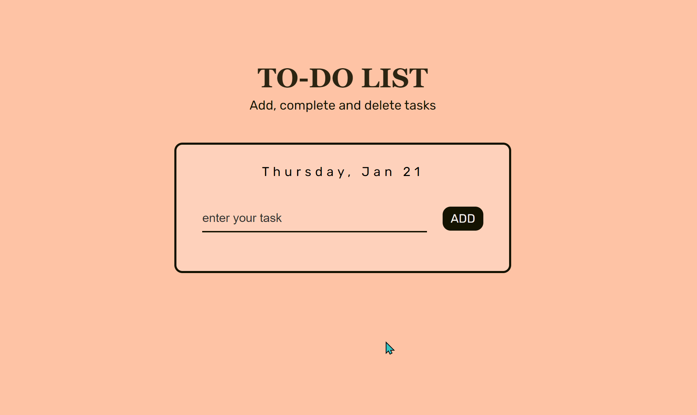

# To-Do-List
To Do List app made using vanilla JavaScript. 

#### Features

- User can add, complete & delete tasks
- View the current date (day, month, date)
- Use the ENTER key to add tasks
- User cannot add task if the input field is empty; window will display an alert pop-up box

### Demo

### To view
See live website here: 
- https://NeirouzJbira.github.io/To-Do-List/

### Technologies

- HTML
- CSS
- JavaScript
